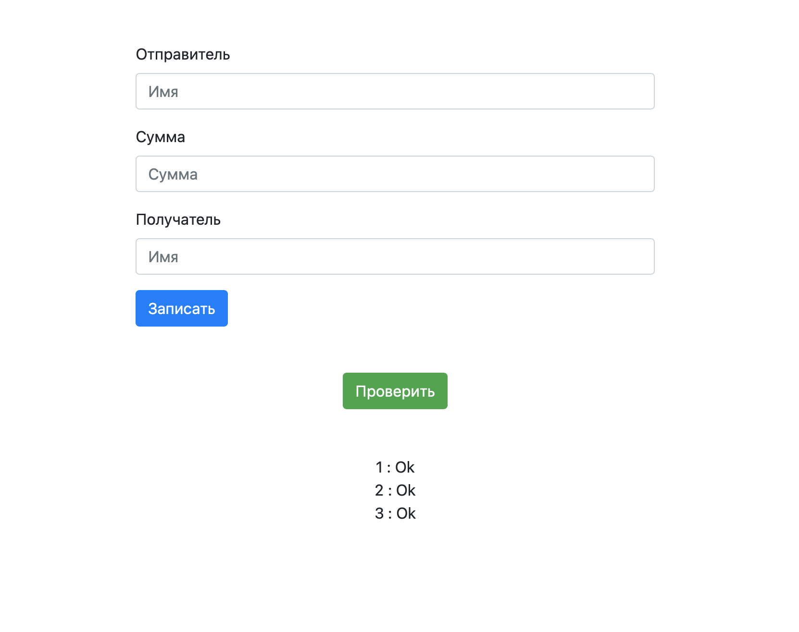

###  A system for recording people's loans that uses blockchain technology to increase the security of stored data and ensure that it cannot be illegally changed  
___  

A new block is created based on the hash of the previous one. Information about each new block is also stored in a special preset block. This is done to make it impossible to change not only all previous blocks, but also the new one just saved.  

If any of the blocks is changed, the site will display information about it.  
  

